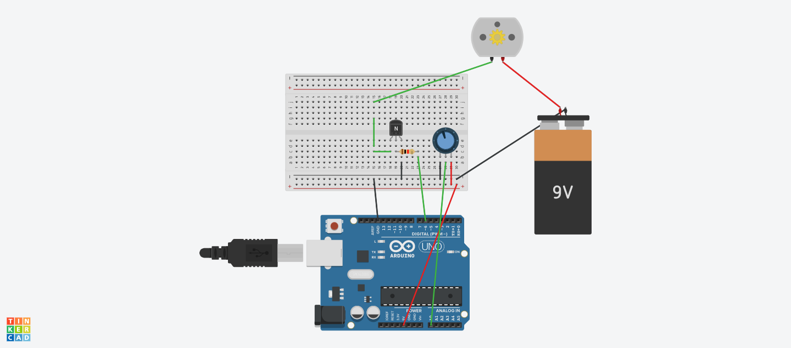

# Arduino-Project
My circuit is using a potentiometer to control a DC motor. I used the breadboard, a resistor, an NPN transistor, and a 9V battery to make it work. You can use the knob to control the speed of the DC motor and it will show you the RPM's. This function can be used for many things.

[link to my Tinkercad Circuits](https://www.tinkercad.com/things/cUclrHTL66t-lilia-joyce-circuit-design-project/editel)
[link to my code](lilia_joyce_circuit_design_project1.ino”)
